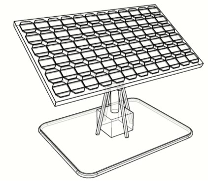
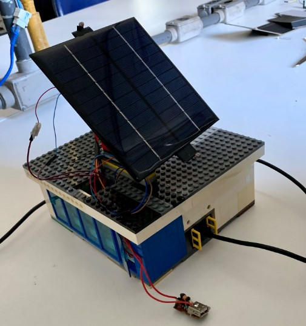
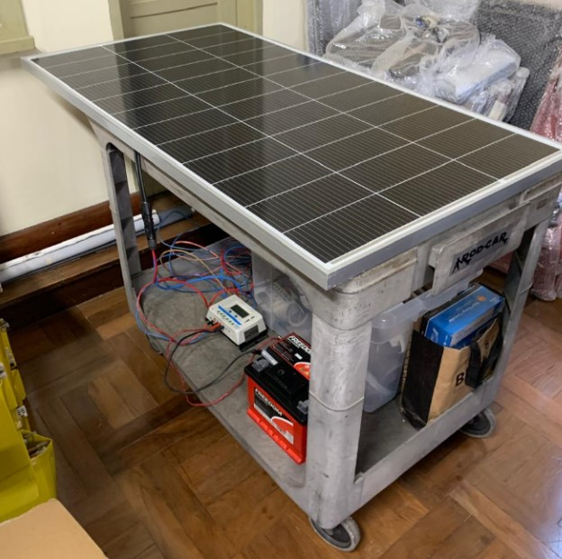
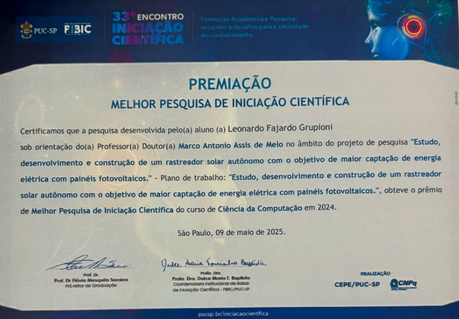

# ☀️ IoT Solar Tracker · Undergraduate Research Project

<p align="center">
  
  
  
</p>

🏆 **Award:** *Best Computer-Science Undergraduate Research*  
33rd PUC-SP Scientific Initiation Meeting (2024)

<p align="center">
  
</p>

This repository gathers the complete material of my 12-month research on an **autonomous solar-tracking system**: C++ firmware for ESP32, 3-D models, circuit schematics, test data and the final report approved by the PUC-SP PIBIC committee.

---

## ✨ Project at a glance
* **Title** — *Study, development and construction of an autonomous solar tracker to increase photovoltaic energy capture*
* **Goal** — Improve panel efficiency by >30 % with a low-cost, single-axis tracker powered by an ESP32.  
* **Key features** — LDR-based adaptive tracking **or** predefined position algorithm; web dashboard; rain & temperature safety routine.  
* **Outcome** — Functional prototype validated in off-grid tests, confirming the energy-gain hypothesis.

---

## 🎯 Research objectives
* Build a residential-scale tracker and compare tracking techniques (LDR vs. scheduled positions).  
* Evaluate real-world energy gain and propose enhancements for a future dual-axis version.

---

## 🔧 Main hardware

| Component | Role |
|-----------|------|
| **ESP32 DevKit V1** | Control, Wi-Fi/BLE |
| **Bipolar stepper / Linear actuator** | Panel movement |
| **PWM Charge Controller 30 A (Epever)** | PV → battery regulation |
| **155 W PV panel + 12 V AGM battery** | Generation & storage |
| **Sensors (LDR, MPU-6050, rain)** | Tracking & safety |

A complete bill of materials is included in the final report (`docs/report`).
---

## 🧑‍💻 How to build & flash

```bash
# Example with PlatformIO
pio run -d code/LDR_Servo     # or any folder under code/
pio upload -d code/LDR_Servo
pio device monitor -b 115200
